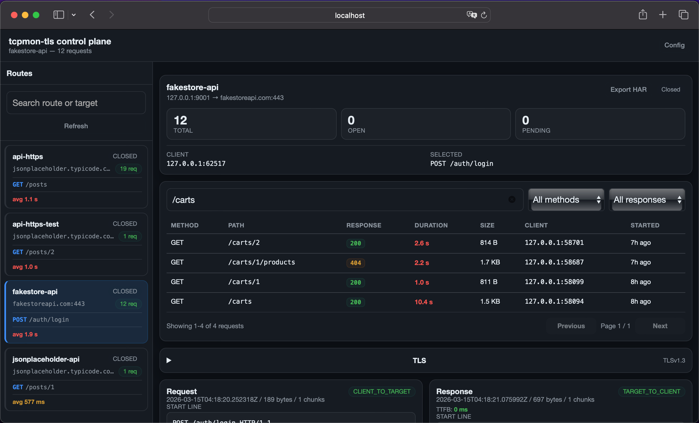

# tcpmon-tls

`tcpmon`-style proxy for modern HTTP/TLS debugging.

`tcpmon-tls` is a Java tool for debugging local and remote integrations over TCP, TLS, and HTTP/HTTPS.

 It lets you inspect `request/response` traffic, intercept payloads, edit HTTP requests, resend them to the target, recapture them through the local listener, and run multiple routes in a single process.

## Highlights

- routes created and managed from the web UI, persisted in SQLite
- multiple listeners and targets per process
- HTTP `request/response` inspection from a local web UI
- interception, structured editing, and forwarding of requests
- replay to the target and recapture through the local listener
- `TLS` and `mTLS` support for inbound and outbound connections
- optional Bearer token authentication for the web UI
- optional HTTPS for the control plane
- `JSON` or `YAML` config file for application-level settings only

## Typical use cases

- debug `local HTTP -> remote HTTPS`
- inspect requests and responses without changing the client
- reproduce integration failures from captured traffic
- validate `TLS/mTLS` connectivity to remote backends
- run several local routes against different targets

The most useful and tested flows today are:

- `local HTTP -> remote HTTPS`
- `local HTTP -> remote HTTP`
- `local TLS -> remote TLS`
- request recapture from the local UI

## What it does

- exposes local TCP or TLS listeners defined via the UI
- forwards traffic to TCP or TLS targets
- supports inbound and outbound `mTLS`
- persists routes and session history in SQLite
- exposes a local web UI for inspection and route management
- separates HTTP `request` and `response` messages when possible
- supports multiple HTTP exchanges within a single keep-alive session
- can resend a request:
  - to the local listener for recapture
  - directly to the configured target

## Requirements

- Java 21
- Maven 3.9+ to build

## Docker

The easiest way to run `tcpmon-tls` is with Docker:

```bash
docker compose up --build
```

Open the UI:

```text
http://localhost:8080/
```

Session data is persisted in a named Docker volume (`sessions_data`). Routes survive container restarts.

To pass additional CLI flags:

```bash
docker compose run --rm tcpmon --intercept-mode REQUEST
```

## Build

```bash
mvn -q package -DskipTests
```

Resulting jar:

```text
target/tcpmon-tls-0.4.0-SNAPSHOT.jar
```

## Quick start

Start the proxy:

```bash
java -jar target/tcpmon-tls-0.4.0-SNAPSHOT.jar
```

Open the UI and create routes from there:

```text
http://127.0.0.1:8080/
```

The app starts with no routes. Use the `+` button in the sidebar to add one. Routes persist across restarts — no config file needed.

## Routes

Routes are the core concept. Each route defines:

- a **listener** — local address and port where clients connect
- a **target** — remote host, port, and transport mode

Routes are created, edited, and deleted from the web UI. They are stored in the SQLite database and reloaded automatically on restart.

### Adding a route

Click `+` in the sidebar. Fill in:

| Field | Description |
|---|---|
| Route ID | Unique identifier for the route |
| Listener Host | Local bind address (`0.0.0.0` or `127.0.0.1`) |
| Listener Port | Local port clients connect to |
| Listener Transport | `PLAIN` or `TLS` |
| Target Host | Remote hostname or IP |
| Target Port | Remote port |
| Target Transport | `PLAIN` or `TLS` |
| Rewrite Host header | Rewrite `Host` to match target (recommended for HTTP->HTTPS) |

When **Target Transport** is `TLS`, additional fields appear:

| Field | Description |
|---|---|
| SNI Host | Hostname announced in the TLS handshake (defaults to target host) |
| Verify hostname | Enable hostname verification |
| Trust all certificates | Disable certificate validation (local testing only) |
| Client Certificate / Keystore | Outbound mTLS material |
| Truststore | Trust material for validating the remote certificate |

When **Listener Transport** is `TLS`, additional fields appear:

| Field | Description |
|---|---|
| Certificate file / Keystore | Server certificate for the local TLS listener |
| Truststore | Trust material for validating inbound client certificates |
| Client Authentication | `None`, `Optional`, or `Require` (for inbound mTLS) |

### Typical route: local HTTP → remote HTTPS

| Field | Value |
|---|---|
| Listener Host | `127.0.0.1` |
| Listener Port | `9000` |
| Listener Transport | `PLAIN` |
| Target Host | `jsonplaceholder.typicode.com` |
| Target Port | `443` |
| Target Transport | `TLS` |
| Rewrite Host header | ✓ |
| Trust all certificates | ✓ (or provide a truststore) |

Test:

```bash
curl -v http://127.0.0.1:9000/posts/1
```

## Configuration file

The config file manages **application-level settings only**. Routes are stored in the database, not in the config file.

Generate an example:

```bash
java -jar target/tcpmon-tls-0.4.0-SNAPSHOT.jar --init-config tcpmon.json
# or
java -jar target/tcpmon-tls-0.4.0-SNAPSHOT.jar --init-config tcpmon.yaml
```

Start with a config file:

```bash
java -jar target/tcpmon-tls-0.4.0-SNAPSHOT.jar --config tcpmon.json
```

### Config file fields

```json
{
  "ui": {
    "host": "127.0.0.1",
    "port": 8080,
    "enabled": true,
    "apiToken": "your-secret-token",
    "tlsKeystore": "./ui-keystore.p12",
    "tlsKeystorePassword": "changeit",
    "tlsKeystoreType": "PKCS12"
  },
  "sessionsDir": "./sessions",
  "interceptMode": "NONE",
  "tlsProtocols": ["TLSv1.3", "TLSv1.2"],
  "tlsCiphers": []
}
```

`apiToken`, `tlsKeystore`, `tlsKeystorePassword`, and `tlsKeystoreType` are optional. Omit them to run without authentication or HTTPS.

The same in `YAML`:

```yaml
ui:
  host: 127.0.0.1
  port: 8080
  enabled: true
  apiToken: your-secret-token
sessionsDir: ./sessions
interceptMode: NONE
tlsProtocols:
  - TLSv1.3
  - TLSv1.2
```

### CLI flags

```bash
java -jar target/tcpmon-tls-0.4.0-SNAPSHOT.jar \
  --ui-host 127.0.0.1 \
  --ui-port 8080 \
  --ui-enabled=true \
  --ui-token your-secret-token \
  --sessions-dir ./sessions \
  --intercept-mode NONE \
  --config tcpmon.json
```

| Flag | Description |
|---|---|
| `--config <path>` | Load settings from a JSON or YAML file |
| `--init-config <path>` | Write an example config to the given path |
| `--ui-host` | Bind address for the web UI |
| `--ui-port` | Port for the web UI |
| `--ui-enabled` | Enable or disable the web UI |
| `--ui-token` | Bearer token required on all `/api/*` requests; omit to disable auth |
| `--ui-tls-keystore` | Keystore path to enable HTTPS for the control plane |
| `--ui-tls-keystore-password` | Password for the UI TLS keystore |
| `--ui-tls-keystore-type` | Keystore type (`PKCS12` by default) |
| `--sessions-dir` | Directory for the SQLite session database |
| `--intercept-mode` | `NONE`, `REQUEST`, `RESPONSE`, or `BOTH` |

## Certificates and TLS

TLS material can be provided as:

- `PEM` certificate + private key files
- `JKS` or `PKCS12` keystore

Both are supported for listener (server) and target (client) sides.

### When to use SNI Host

Controls the hostname sent in the TLS handshake to the remote target. Useful when:

- connecting by IP but the certificate is issued for a hostname
- the remote server uses TLS virtual hosting
- you want to decouple the target host from the SNI announcement

### `Trust all certificates`

Disables remote certificate validation for outbound TLS. Intended for local testing or environments with internal certificates. Should not be used in production.

### `Rewrite Host header`

Rewrites the HTTP `Host` header before sending the request to the remote target. Needed in flows like `curl http://127.0.0.1:9000/...` where the backend expects `Host: api.example.com`. Without this, many backends return `403`, `421`, or incorrect responses.

## Local UI

The UI shows:

- route list with Add, Edit, and Delete actions
- session list with method, path, response status, duration, and response size per request
- performance summary per route (average duration, error count)
- request and response payload with headers and formatted body
- TLS panel per session (inbound and outbound protocol, cipher suite, SNI)
- TTFB indicator in the response card
- session timing waterfall (TLS inbound, TLS outbound, wait, download, total)
- exchange diff for keep-alive sessions with multiple HTTP exchanges

### Available actions

For `CLIENT_TO_TARGET` payloads:

- `Recapture request` — resends the request through the local listener and captures it as a new session
- `Send direct` — resends the request directly to the configured target
- `Copy as cURL` — copies the request as a ready-to-run `curl` command

For intercepted payloads:

- `Forward original`
- `Edit and forward`

### Export

- `Export HAR` — exports all sessions in the active route as a HAR 1.2 file, importable in Chrome DevTools or Postman

### Configuration panel

The topbar exposes a `Config` button that shows the active proxy configuration: routes, listener and target addresses, transport modes, and intercept mode. This reads from `GET /api/config`.

## Security

### Authentication

When `--ui-token` is set, every `/api/*` request must include:

```
Authorization: Bearer your-secret-token
```

The SSE endpoint (`/api/events`) also accepts the token as a query parameter for browser `EventSource` clients that cannot set custom headers:

```
GET /api/events?token=your-secret-token
```

When the flag is omitted, the API is open (default for local use).

### HTTPS for the control plane

Provide a PKCS12 or JKS keystore to serve the UI over HTTPS:

```bash
java -jar target/tcpmon-tls-0.4.0-SNAPSHOT.jar \
  --ui-tls-keystore ./ui.p12 \
  --ui-tls-keystore-password changeit
```

The control plane is then available at `https://127.0.0.1:8080/`.

### Encrypted passwords at rest

Keystore and truststore passwords stored in the SQLite database are encrypted with **AES-256-GCM**. A 256-bit key is generated automatically on first run and written to `sessions/db.key`. On POSIX systems the file is created with `600` permissions. Existing databases with plaintext passwords are migrated transparently on first read.

Do not delete or move `db.key` while routes with TLS passwords exist in the database — it is required to decrypt them.

### HTTP security headers

All responses include:

| Header | Value |
|---|---|
| `X-Frame-Options` | `DENY` |
| `X-Content-Type-Options` | `nosniff` |
| `X-XSS-Protection` | `1; mode=block` |
| `Cache-Control` | `no-store` |

## Persistence

Session history and routes are stored under the directory configured in `sessionsDir`.

```text
sessions/
├── sessions.db   # SQLite database (routes, sessions, events)
└── db.key        # AES-256-GCM encryption key for stored passwords
```

### What is stored

- routes (listener, target, transport, TLS material paths)
- session open/close metadata
- lifecycle events and errors
- TLS metadata
- request/response payloads
- event details used by the local UI

`pending payloads` remain in memory only and are not restored after restart.

## Interception

`--intercept-mode` supports:

- `NONE`
- `REQUEST`
- `RESPONSE`
- `BOTH`

When a direction is intercepted:

- the payload is not forwarded immediately
- it stays pending in memory
- you can forward it as-is or edit it from the UI

## Current limitations

- the UI HTTP parser supports `Content-Length`, `Transfer-Encoding: chunked`, `gzip`, `deflate`, and `br`
- it still does not interpret:
  - WebSocket
  - incremental HTTP streaming
- local recapture to a `TLS` listener with `client auth REQUIRE` does not present a client certificate yet
- the tool is optimized for local debugging, not high throughput
- the UI is focused on HTTP; generic TCP traffic falls back to raw view

## Development

Run tests:

```bash
mvn -q test
```

## Project structure

```text
src/main/java/com/cafeina/tcpmon/
├── config/     # JSON/YAML config loading
├── proxy/      # listeners, bridges, and HTTP rewriting
├── replay/     # resend to listener or target
├── security/   # AES-256-GCM password encryption (PasswordEncryptor)
├── session/    # session model and persistence
├── tls/        # TLS context construction
├── util/       # helpers
└── web/        # local API and UI
```
