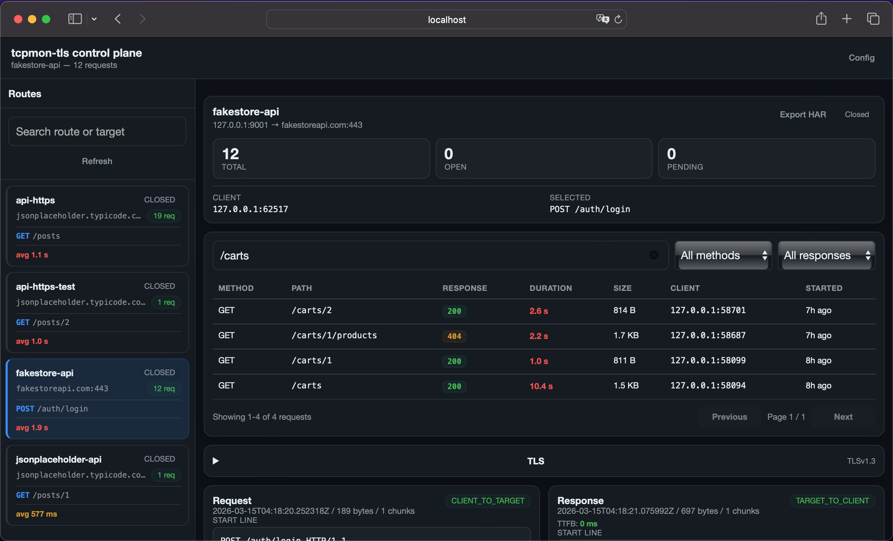

# tcpmon-tls

`tcpmon`-style proxy for modern HTTP/TLS debugging.

`tcpmon-tls` is a Java tool for debugging local and remote integrations over TCP, TLS, and HTTP/HTTPS.

Current release: `0.6.13`

 It lets you inspect `request/response` traffic, intercept payloads, edit HTTP requests, resend them to the target, recapture them through the local listener, and run multiple routes in a single process.

## Highlights

- routes created and managed from the web UI, persisted in SQLite
- multiple listeners and targets per process
- HTTP `request/response` inspection from a local web UI
- route-centric control plane with operational route health and active request context
- interception, structured editing, and forwarding of requests
- conditional interception per route — only pause requests matching a method/path filter, everything else forwards automatically
- mock/stub responses per route — reply with a canned status, headers, and body without ever reaching the target, even if it's unreachable
- per-route latency simulation — inject a fixed delay on the request and/or response leg to reproduce slow-network conditions
- replay to the target and recapture through the local listener, including recapture into `mTLS`-required listeners via a dedicated replay identity certificate
- a Request Builder to compose and send arbitrary requests to a route, including from an imported HAR entry
- cross-route search across all captured traffic, and free-text notes per session
- `TLS` and `mTLS` support for inbound and outbound connections, with per-route protocol and cipher suite overrides
- optional Bearer token authentication for the web UI
- optional HTTPS for the control plane
- `JSON` or `YAML` config file for application-level settings only

## Typical use cases

- debug `local HTTP -> remote HTTPS`
- inspect requests and responses without changing the client
- reproduce integration failures from captured traffic
- validate `TLS/mTLS` connectivity to remote backends
- run several local routes against different targets

The most useful and tested flows today are:

- `local HTTP -> remote HTTPS`
- `local HTTP -> remote HTTP`
- `local TLS -> remote TLS`
- request recapture from the local UI

## What it does

- exposes local TCP or TLS listeners defined via the UI
- forwards traffic to TCP or TLS targets
- supports inbound and outbound `mTLS`
- persists routes and session history in SQLite
- exposes a local web UI for inspection and route management
- separates HTTP `request` and `response` messages when possible
- supports multiple HTTP exchanges within a single keep-alive session
- can resend a request:
  - to the local listener for recapture
  - directly to the configured target

## Requirements

- Java 21
- Maven 3.9+ to build

## Docker

The easiest way to run `tcpmon-tls` is with Docker:

```bash
docker compose up --build
```

Open the UI:

```text
http://localhost:8080/
```

Session data is persisted in a named Docker volume (`sessions_data`). Routes survive container restarts.

To pass additional CLI flags:

```bash
docker compose run --rm tcpmon --intercept-mode REQUEST
```

## Build

```bash
mvn -q package -DskipTests
```

Resulting jar:

```text
target/tcpmon-tls-0.6.13.jar
```

## Quick start

Start the proxy:

```bash
java -jar target/tcpmon-tls-0.6.13.jar
```

Open the UI and create routes from there:

```text
http://127.0.0.1:8080/
```

The app starts with no routes. Use the `+` button in the sidebar to add one. Routes persist across restarts — no config file needed.

## Routes

Routes are the core concept. Each route defines:

- a **listener** — local address and port where clients connect
- a **target** — remote host, port, and transport mode

Routes are created, edited, and deleted from the web UI. They are stored in the SQLite database and reloaded automatically on restart.

### Adding a route

Click `+` in the sidebar. Fill in:

| Field | Description |
|---|---|
| Route ID | Unique identifier for the route |
| Listener Host | Local bind address (`0.0.0.0` or `127.0.0.1`) |
| Listener Port | Local port clients connect to |
| Listener Transport | `PLAIN` or `TLS` |
| Target Host | Remote hostname or IP |
| Target Port | Remote port |
| Target Transport | `PLAIN` or `TLS` |
| Rewrite Host header | Rewrite `Host` to match target (recommended for HTTP->HTTPS) |

When **Target Transport** is `TLS`, additional fields appear:

| Field | Description |
|---|---|
| SNI Host | Hostname announced in the TLS handshake (defaults to target host) |
| Verify hostname | Enable hostname verification |
| Trust all certificates | Disable certificate validation (local testing only) |
| Client Certificate / Keystore | Outbound mTLS material |
| Truststore | Trust material for validating the remote certificate |
| TLS protocols / Cipher suites | Override the global `tlsProtocols`/`tlsCiphers` config for this target only; leave blank to use the global default |

When **Listener Transport** is `TLS`, additional fields appear:

| Field | Description |
|---|---|
| Certificate file / Keystore | Server certificate for the local TLS listener |
| Truststore | Trust material for validating inbound client certificates |
| Client Authentication | `None`, `Optional`, or `Require` (for inbound mTLS) |
| TLS protocols / Cipher suites | Override the global `tlsProtocols`/`tlsCiphers` config for this listener only; leave blank to use the global default |
| Recapture client identity | A client certificate/keystore presented when recapturing a request through this listener. Required if Client Authentication is `Require` — see [Recapture into an mTLS-required listener](#recapture-into-an-mtls-required-listener) |

### Simulating a slow network

Each route has an optional **Simulation** section with two fields:

| Field | Description |
|---|---|
| Request delay (ms) | Delay applied before forwarding the client's request to the target |
| Response delay (ms) | Delay applied before forwarding the target's response to the client |

Both default to `0` (no delay, current behavior). The delay only applies to traffic that is forwarded immediately — it does not add to the time a payload spends held for manual interception.

### Conditional interception

By default, `--intercept-mode` pauses **every** request/response on **every** route. Each route can narrow that down with an optional method/path filter in the **Conditional Interception** section:

| Field | Description |
|---|---|
| Method | Only pause requests with this HTTP method (case-insensitive). Blank matches any method |
| Path contains | Only pause requests whose path contains this substring. Blank matches any path |

If both are blank (the default), the route intercepts unconditionally. The filter only applies to the request direction — response interception under `RESPONSE`/`BOTH` mode is unaffected.

### Mock responses

Each route can serve a canned response for matching requests instead of reaching the target, via the **Mock Response** section:

| Field | Description |
|---|---|
| Status code | HTTP status code to return. `0` disables mocking (default) |
| Method | Only mock requests with this HTTP method. Blank matches any method |
| Path contains | Only mock requests whose path contains this substring. Blank matches any path |
| Headers | Response headers, one `Name: Value` per line |
| Body | Response body |

Mocking works even if the target is unreachable — a request that doesn't match the mock filter still proxies normally to the target (or fails the same way an unmocked route would if the target is down).

### Typical route: local HTTP → remote HTTPS

| Field | Value |
|---|---|
| Listener Host | `127.0.0.1` |
| Listener Port | `9000` |
| Listener Transport | `PLAIN` |
| Target Host | `jsonplaceholder.typicode.com` |
| Target Port | `443` |
| Target Transport | `TLS` |
| Rewrite Host header | ✓ |
| Trust all certificates | ✓ (or provide a truststore) |

Test:

```bash
curl -v http://127.0.0.1:9000/posts/1
```

## Configuration file

The config file manages **application-level settings only**. Routes are stored in the database, not in the config file.

Generate an example:

```bash
java -jar target/tcpmon-tls-0.6.13.jar --init-config tcpmon.json
# or
java -jar target/tcpmon-tls-0.6.13.jar --init-config tcpmon.yaml
```

Start with a config file:

```bash
java -jar target/tcpmon-tls-0.6.13.jar --config tcpmon.json
```

### Config file fields

```json
{
  "ui": {
    "host": "127.0.0.1",
    "port": 8080,
    "enabled": true,
    "apiToken": "your-secret-token",
    "tlsKeystore": "./ui-keystore.p12",
    "tlsKeystorePassword": "changeit",
    "tlsKeystoreType": "PKCS12"
  },
  "sessionsDir": "./sessions",
  "interceptMode": "NONE",
  "tlsProtocols": ["TLSv1.3", "TLSv1.2"],
  "tlsCiphers": [],
  "logging": {
    "level": "INFO",
    "format": "text",
    "accessLog": false,
    "metricsLog": false
  }
}
```

`apiToken`, `tlsKeystore`, `tlsKeystorePassword`, and `tlsKeystoreType` are optional. Omit them to run without authentication or HTTPS.

The same in `YAML`:

```yaml
ui:
  host: 127.0.0.1
  port: 8080
  enabled: true
  apiToken: your-secret-token
sessionsDir: ./sessions
interceptMode: NONE
tlsProtocols:
  - TLSv1.3
  - TLSv1.2
logging:
  level: INFO
  format: text
  accessLog: false
  metricsLog: false
```

### CLI flags

```bash
java -jar target/tcpmon-tls-0.6.13.jar \
  --ui-host 127.0.0.1 \
  --ui-port 8080 \
  --ui-enabled=true \
  --ui-token your-secret-token \
  --sessions-dir ./sessions \
  --intercept-mode NONE \
  --log-level INFO \
  --log-format text \
  --config tcpmon.json
```

| Flag | Description |
|---|---|
| `--config <path>` | Load settings from a JSON or YAML file |
| `--init-config <path>` | Write an example config to the given path |
| `--ui-host` | Bind address for the web UI |
| `--ui-port` | Port for the web UI |
| `--ui-enabled` | Enable or disable the web UI |
| `--ui-token` | Bearer token required on all `/api/*` requests; omit to disable auth |
| `--ui-tls-keystore` | Keystore path to enable HTTPS for the control plane |
| `--ui-tls-keystore-password` | Password for the UI TLS keystore |
| `--ui-tls-keystore-type` | Keystore type (`PKCS12` by default) |
| `--sessions-dir` | Directory for the SQLite session database |
| `--intercept-mode` | `NONE`, `REQUEST`, `RESPONSE`, or `BOTH` |
| `--log-level` | Logging level: `TRACE`, `DEBUG`, `INFO`, `WARN`, or `ERROR` |
| `--log-format` | Console log format: `text` or `json` |
| `--access-log` | Enable control plane access logs |
| `--metrics-log` | Enable lightweight metrics logs for selected API queries |

### Logging

By default, `tcpmon-tls` logs operational events at `INFO`: startup, shutdown, bound routes, control plane state, route changes, replay completion, and warnings/errors. Use `DEBUG` when diagnosing route connectivity, TLS handshakes, replay behavior, or connection lifecycle. Use `TRACE` only for short local investigations.

Logs intentionally do not include payload bodies, base64 payloads, API tokens, keystore passwords, private keys, or full certificates. Captured traffic remains in the SQLite session store and the web UI; logs are for runtime diagnosis, not traffic history.

## Certificates and TLS

TLS material can be provided as:

- `PEM` certificate + private key files
- `JKS` or `PKCS12` keystore

Both are supported for listener (server) and target (client) sides.

### When to use SNI Host

Controls the hostname sent in the TLS handshake to the remote target. Useful when:

- connecting by IP but the certificate is issued for a hostname
- the remote server uses TLS virtual hosting
- you want to decouple the target host from the SNI announcement

### `Trust all certificates`

Disables remote certificate validation for outbound TLS. Intended for local testing or environments with internal certificates. Should not be used in production.

### `Rewrite Host header`

Rewrites the HTTP `Host` header before sending the request to the remote target. Needed in flows like `curl http://127.0.0.1:9000/...` where the backend expects `Host: api.example.com`. Without this, many backends return `403`, `421`, or incorrect responses.

### Recapture into an mTLS-required listener

Recapturing a request resends it through the route's own local listener so it gets captured as a new session. If the listener's **Client Authentication** is `Require`, that handshake needs a client certificate — but the proxy never holds the real client's private key, so it can't impersonate the original caller. Configure a **Recapture client identity** (a certificate/keystore dedicated to this purpose) in the listener's TLS section; the proxy presents it only when recapturing into that listener. Without one, recapture into a `Require`-mode listener fails with an explicit error instead of a generic connection failure.

## Local UI

The UI shows:

- route list with Add, Edit, and Delete actions
- session list with method, path, response status, duration, and response size per request
- performance summary per route (average duration, error count)
- request and response payload with headers and formatted body
- TLS panel per session (inbound and outbound protocol, cipher suite, SNI)
- TTFB indicator in the response card
- session timing waterfall (TLS inbound, TLS outbound, wait, download, total)
- exchange diff for keep-alive sessions with multiple HTTP exchanges
- a free-text notes field per session, for annotating captured traffic
- a `Search all routes` toggle in the request table to search across every route instead of just the active one

### Available actions

For `CLIENT_TO_TARGET` payloads:

- `Recapture request` — resends the request through the local listener and captures it as a new session
- `Send direct` — resends the request directly to the configured target
- `Copy as cURL` — copies the request as a ready-to-run `curl` command

For intercepted payloads:

- `Forward original`
- `Edit and forward`

### Request Builder

The `New request` button in the sidebar opens a Request Builder modal: pick a route, then compose a method, path, query, HTTP version, headers, and body from scratch, and send it either to the target or to the local listener (for recapture). Imported HAR entries prefill the same modal.

### HAR export and import

- `Export HAR` — exports all sessions in the active route as a HAR 1.2 file, importable in Chrome DevTools or Postman
- `Import HAR` — the sidebar's import button loads a HAR file and opens the Request Builder prefilled with a chosen entry (method, path, query, headers, body); if the file has multiple entries, a picker lets you choose which one to load

### Configuration panel

The topbar exposes a `Config` button that shows the active proxy configuration: routes, listener and target addresses, transport modes, and intercept mode. This reads from `GET /api/config`.

## Security

### Authentication

When `--ui-token` is set, every `/api/*` request must include:

```
Authorization: Bearer your-secret-token
```

The SSE endpoint (`/api/events`) also accepts the token as a query parameter for browser `EventSource` clients that cannot set custom headers:

```
GET /api/events?token=your-secret-token
```

When the flag is omitted, the API is open (default for local use).

### HTTPS for the control plane

Provide a PKCS12 or JKS keystore to serve the UI over HTTPS:

```bash
java -jar target/tcpmon-tls-0.6.13.jar \
  --ui-tls-keystore ./ui.p12 \
  --ui-tls-keystore-password changeit
```

The control plane is then available at `https://127.0.0.1:8080/`.

### Encrypted passwords at rest

Keystore and truststore passwords stored in the SQLite database are encrypted with **AES-256-GCM**. A 256-bit key is generated automatically on first run and written to `sessions/db.key`. On POSIX systems the file is created with `600` permissions. Existing databases with plaintext passwords are migrated transparently on first read.

Do not delete or move `db.key` while routes with TLS passwords exist in the database — it is required to decrypt them.

### HTTP security headers

All responses include:

| Header | Value |
|---|---|
| `X-Frame-Options` | `DENY` |
| `X-Content-Type-Options` | `nosniff` |
| `X-XSS-Protection` | `1; mode=block` |
| `Cache-Control` | `no-store` |

## Persistence

Session history and routes are stored under the directory configured in `sessionsDir`.

```text
sessions/
├── sessions.db   # SQLite database (routes, sessions, events)
└── db.key        # AES-256-GCM encryption key for stored passwords
```

### What is stored

- routes (listener, target, transport, TLS material paths)
- session open/close metadata
- lifecycle events and errors
- TLS metadata
- request/response payloads
- event details used by the local UI

`pending payloads` remain in memory only and are not restored after restart.

## Interception

`--intercept-mode` supports:

- `NONE`
- `REQUEST`
- `RESPONSE`
- `BOTH`

When a direction is intercepted:

- the payload is not forwarded immediately
- it stays pending in memory
- you can forward it as-is or edit it from the UI

`--intercept-mode` is a global switch across all routes. Each route can further narrow it down with a **Conditional Interception** method/path filter (see [Conditional interception](#conditional-interception)) so only requests matching that filter actually pause — everything else on the route forwards automatically.

## Current limitations

- the UI HTTP parser supports `Content-Length`, `Transfer-Encoding: chunked`, `gzip`, `deflate`, and `br`
- it still does not interpret:
  - WebSocket
  - incremental HTTP streaming
- the tool is optimized for local debugging, not high throughput
- the UI is focused on HTTP; generic TCP traffic falls back to raw view

## Development

Run tests:

```bash
npm run test:all
mvn -q test
npm run test:web
```

`npm run test:all` runs both suites. `mvn -q test` covers the Java backend and control plane. `npm run test:web` runs the lightweight frontend helper suite with Node's built-in test runner, without extra dependencies.

## License

Apache-2.0. See [LICENSE](LICENSE).

## Project structure

```text
src/main/java/com/cafeina/tcpmon/
├── config/     # JSON/YAML config loading
├── proxy/      # listeners, bridges, and HTTP rewriting
├── replay/     # resend to listener or target
├── security/   # AES-256-GCM password encryption (PasswordEncryptor)
├── session/    # session model and persistence
├── tls/        # TLS context construction
├── util/       # helpers
└── web/        # local API and UI
```
